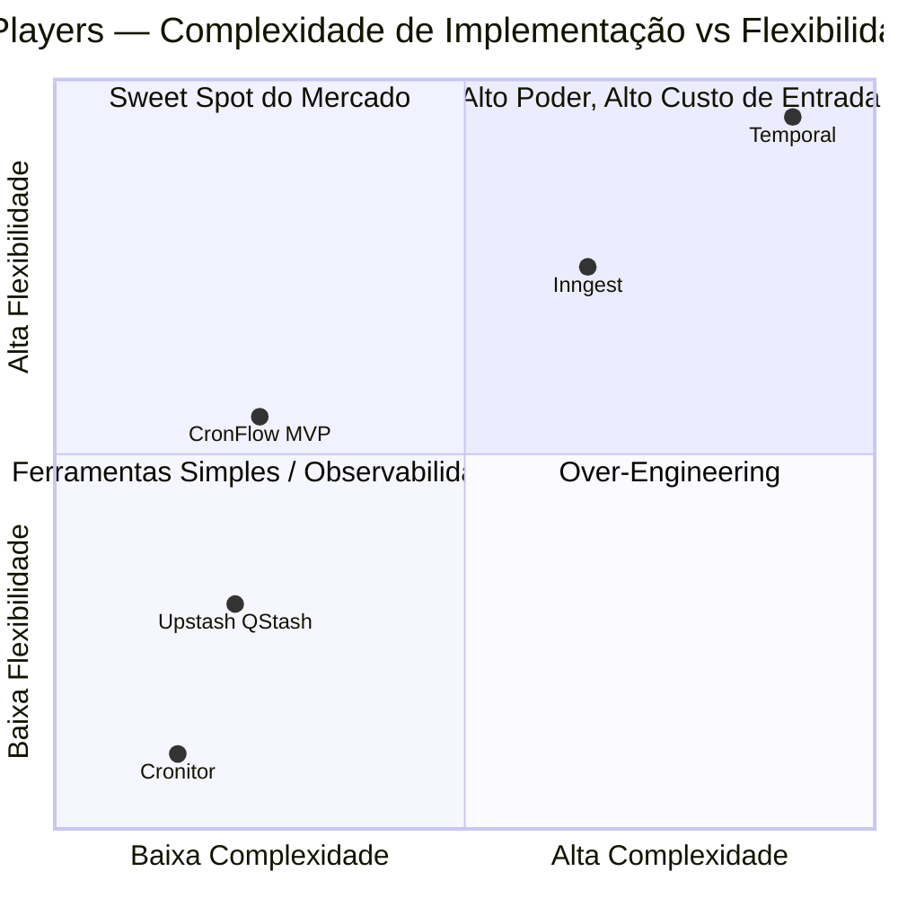
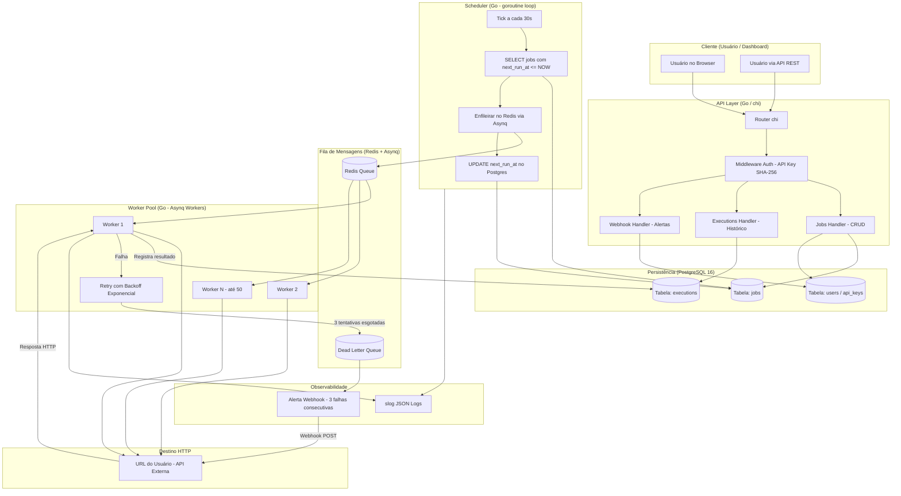
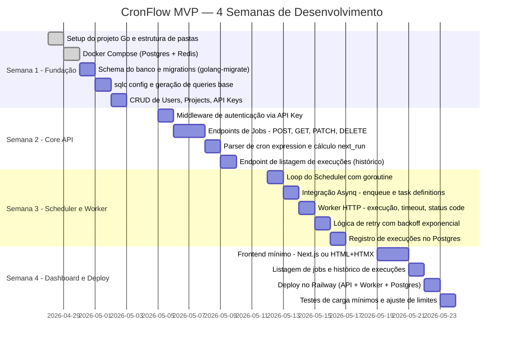

# Documento de Visão e Arquitetura — CronFlow SaaS
**Plataforma de Automação e Agendamento de Tarefas / Webhooks**

> **Classificação:** Interno — Para leitura de Dev Back-end
> **Autor:** Arquiteto de Software Sênior / Tech Lead
> **Versão:** 1.0 — MVP
> **Data:** Abril 2026

---

## Prefácio: Por que este documento existe?

Todo produto morre por uma de duas razões: foi construído para o problema errado ou foi construído da maneira errada. Este documento existe para eliminar ambos os riscos antes de escrever a primeira linha de código. Ele é opinionado por design. Aqui não existem "depende" sem uma decisão final logo em seguida.

Se você está lendo isso como desenvolvedor de back-end e ainda está aprendendo, preste atenção especial às seções de tech stack e arquitetura. Cada decisão aqui tem um "porquê" técnico rastreável — isso é o que separa um arquiteto de um programador que apenas copia tutorial.

---

## 1. DEFINIÇÃO DO NICHO E PROPOSTA DE VALOR

### 1.1 Qual é a dor exata que estamos resolvendo?

A dor é simples de enunciar e brutal na prática:

> **"Eu preciso que algo aconteça em segundo plano, no horário certo, de forma confiável, sem eu precisar manter um servidor ligado 24h."**

Desenvolvedores — especialmente os que trabalham com arquiteturas serverless, JAMstack ou front-end com BFF (Backend for Frontend) mínimo — constantemente precisam de **background jobs**. Exemplos concretos do mundo real:

- Enviar e-mail de cobrança todo dia 1º do mês às 09h
- Verificar se uma API de terceiro está online a cada 5 minutos
- Processar relatórios pesados toda sexta às 23h para não travar o banco em produção
- Disparar um webhook para o Slack quando um usuário completa 30 dias sem login
- Deletar dados expirados (LGPD compliance) toda madrugada

O problema **não é falta de código** — qualquer dev sabe criar um `setTimeout` ou um `setInterval`. O problema é a **infraestrutura de garantia**: o que acontece quando o job falha? Quando o servidor reinicia no meio da execução? Quando preciso auditar o que foi disparado às 03h da manhã?

**A solução atual da maioria dos devs é gambiarra em camadas:**

1. `cron` no Linux — sem interface, sem retry, sem histórico, morre com o servidor
2. `celery + redis` — complexo de configurar, exige conhecimento de Python e DevOps
3. Cloud Functions com Cloud Scheduler — vendor lock-in, billing imprevisível, config no console AWS/GCP
4. GitHub Actions agendados — adaptação de ferramenta errada para o problema

**Nossa proposta de valor é cirúrgica:**

> **CronFlow**: Uma API REST + Dashboard onde em menos de 5 minutos você cadastra uma tarefa agendada (cron expression ou intervalo fixo), aponta para qualquer URL HTTP(S), e a gente garante a execução com retry automático, logs auditáveis e alertas — sem você gerenciar nenhuma infra.

---

### 1.2 Quem é o Cliente Ideal do MVP?

Definindo o **ICP (Ideal Customer Profile)** para a V1:

**Persona primária — O Indie Hacker / Micro-SaaS Builder:**
- Desenvolvedor solo ou dupla, construindo produto próprio nas horas vagas
- Stack típica: Next.js ou Nuxt no front, Supabase ou PlanetScale no banco, Vercel/Railway no deploy
- **Dor principal:** Vercel e Netlify Functions têm timeout de 10-30s. Jobs longos simplesmente não funcionam nessas plataformas.
- **Disposição a pagar:** $9–$29/mês sem pensar muito, desde que resolva o problema

**Persona secundária — A Pequena Agência Digital:**
- Time de 3–10 devs atendendo múltiplos clientes
- Precisam de jobs recorrentes para relatórios, sincronizações de CRM, envio de NFe
- **Dor principal:** Não quer manter infraestrutura separada de agendamento para cada projeto de cliente
- **Disposição a pagar:** $49–$99/mês se tiver multi-tenant e separação por projeto

**Persona terciária (fora do MVP) — Empresa Mid-Market:**
- Necessidades complexas (workflows encadeados, SLA de 99.99%, on-premise)
- Não é nosso alvo agora. Eles têm budget mas exigem compliance, contratos e suporte 24/7

---

### 1.3 Os Números que Justificam o Mercado

**Dado #1 — Tamanho do mercado de Workflow Automation:**
O mercado global de **Business Process Automation** foi avaliado em **~$13.6 bilhões em 2023** e deve crescer a uma CAGR de 13.4% até 2030 (Grand View Research, 2024). Mesmo capturando 0.001% desse mercado, estamos falando de $136.000/ano em ARR — suficiente para validar o produto com uma equipe enxuta.

**Dado #2 — A ascensão do serverless criou um problema estrutural:**
Segundo o relatório **State of Serverless 2023 (Datadog)**, mais de **70% das organizações que adotam arquiteturas serverless** relatam dificuldade em implementar tarefas agendadas e processos de longa duração. O serverless resolve latência de request/response, mas é estruturalmente incompatível com jobs recorrentes — isso é um gap arquitetural, não de preferência.

**Dado #3 — O ecossistema de indie hackers é grande e monetizável:**
A plataforma **Indie Hackers** (Stripe) tem mais de 500.000 membros ativos. O Patio11's newsletter (Patrick McKenzie, ex-Stripe) estima que existem entre **150.000 e 300.000 micro-SaaS ativos** globalmente gerando mais de $1.000/mês. Cada um desses produtos precisa de background jobs. A disposição mediana a pagar por ferramentas de infra nessa audiência é de **$15–$50/mês** (baseado em pesquisas públicas do MicroConf).

---

## 2. COMPARAÇÃO DE MERCADO (QUADRANTE MÁGICO)

### 2.1 Análise dos 4 Players Principais

#### Cronitor
- **Foco:** Monitoramento de cron jobs existentes, não execução
- **Ponto forte:** Interface limpa, ótimo para alertas e heartbeat monitoring
- **Ponto fraco:** Não executa nada — você ainda precisa do seu próprio infra de cron. É um wrapper de observabilidade, não uma plataforma de execução.
- **Preço:** Free tier generoso, pago a partir de $29/mês
- **Complexidade de adoção:** Baixa (só adiciona uma URL de ping no seu cron existente)
- **Flexibilidade de workflow:** Muito baixa — sem encadeamento, sem retry configurável, sem payload

#### Upstash QStash
- **Foco:** Message queue + HTTP scheduler serverless, construído sobre Redis
- **Ponto forte:** Extremamente simples de usar via HTTP, latência baixa, bom free tier, integração nativa com Vercel/Next.js
- **Ponto fraco:** Focado em mensagens point-to-point. Não tem dashboard rico, sem workflows encadeados, logs limitados no free tier. É uma primitiva, não um produto.
- **Preço:** Free (10.000 mensagens/dia), depois $1 por 100k mensagens
- **Complexidade de adoção:** Muito baixa
- **Flexibilidade de workflow:** Baixa — sem fanout nativo, sem dependência entre jobs

#### Inngest
- **Foco:** Workflow orchestration com código — você escreve funções TypeScript/Go que o Inngest orquestra
- **Ponto forte:** Developer experience excepcional, retry com backoff configurável por código, eventos como trigger, suporte a steps encadeados nativamente
- **Ponto fraco:** Curva de aprendizado relevante (você muda como escreve seu código), vendor lock-in no SDK, pricing pode ser imprevisível em alto volume
- **Preço:** Free tier (50k function runs/mês), pago a partir de $35/mês
- **Complexidade de adoção:** Média-alta — exige refatorar sua aplicação para usar o SDK
- **Flexibilidade de workflow:** Alta — é o mais flexível entre os players simples

#### Temporal
- **Foco:** Workflow engine empresarial para processos durável e fault-tolerant
- **Ponto forte:** Absolutamente robusto, battle-tested em produção em Uber, Netflix, Coinbase. Suporte a workflows de meses de duração, sagas distribuídas, compensações.
- **Ponto fraco:** É um canhão para matar formiga. Exige cluster Kubernetes para auto-hospedar, curva de aprendizado de semanas, overhead arquitetural significativo, cloud version é cara.
- **Preço:** Self-hosted gratuito (mas caro em infra), cloud a partir de $0.025 por action
- **Complexidade de adoção:** Alta — é uma plataforma, não uma ferramenta
- **Flexibilidade de workflow:** Máxima — pode modelar qualquer processo

### 2.2 Onde o CronFlow se Posiciona

Nossa aposta é o **quadrante de baixa complexidade + flexibilidade crescente**: mais fácil que Inngest/Temporal, mas com mais poder que Cronitor/QStash. A proposição é: **você não precisa mudar seu código. Só aponta uma URL.**



**Leitura do quadrante:**
- **Cronitor** está no canto inferior esquerdo — fácil de adotar, mas faz pouco
- **Temporal** está no canto superior direito — faz tudo, mas é complexo demais para indie hackers
- **CronFlow MVP** mira intencionalmente o quadrante superior esquerdo: **fácil de adotar, faz mais do que o esperado**. Esse é o gap que os players atuais não preenchem com excelência.

---

## 3. REGRAS DE NEGÓCIO MÍNIMAS (MVP)

### 3.1 O que ENTRA no MVP (V1 — Inegociável)

**Jobs e Agendamento:**
- Criação de job via API REST autenticada (`POST /v1/jobs`)
- Suporte a **cron expressions** padrão UNIX (ex: `0 9 * * 1` = toda segunda às 9h)
- Suporte a **intervalos fixos** em minutos (ex: `every: 15m`)
- Timezone configurável por job (padrão: UTC)
- Ação do job: disparar um **HTTP Request** (GET ou POST) para uma URL definida pelo usuário

**Execução e Confiabilidade:**
- **Retry automático** com backoff exponencial: 3 tentativas (1min, 5min, 15min após falha)
- Definição de falha: status HTTP >= 400 ou timeout
- Timeout do worker configurável por job: mínimo 5s, máximo **30 segundos** no MVP
- Garantia de **at-least-once delivery** (pode disparar duplicado em edge cases de falha — documentado)
- Registro de cada tentativa (sucesso, falha, payload de resposta truncado em 2KB)

**Autenticação e Multi-tenancy:**
- Autenticação via **API Key** por projeto
- Um usuário pode ter múltiplos projetos (workspaces)
- Cada projeto tem isolamento total: jobs de um projeto não afetam outro

**Dashboard Mínimo:**
- Listagem de jobs com status (ativo/pausado/com falha)
- Histórico de execuções com status HTTP, duração e timestamp
- Criar, pausar, reativar e deletar jobs via UI
- Ativar/desativar job sem deletar (soft pause)

**Observabilidade:**
- **Log de execução** retido por **7 dias** no plano free
- Alerta via webhook configurável: notifica a URL do usuário quando um job falha 3 vezes consecutivas
- Endpoint de healthcheck público: `GET /health`

---

### 3.2 O que FICA FORA do MVP (Explicitamente)

| Feature | Justificativa para excluir |
|---|---|
| Workflows encadeados (Etapa A → B → C) | Aumenta complexidade do scheduler em 10x. V2. |
| Fanout (1 trigger → N execuções paralelas) | Exige fila de mensagens sofisticada. V2. |
| Execução de código arbitrário (Lambda-style) | Problemas sérios de segurança (sandboxing). V3. |
| SSO / SAML | Para enterprise. Fora do ICP do MVP. |
| Suporte a FTP, SFTP, bancos de dados como destino | MVP é só HTTP. Ponto. |
| SLA contratual de uptime | Não vendemos isso antes de ter histórico de operação. |
| Histórico de logs além de 7 dias (free) | Custo de storage. Feature paga. |
| Retry configurável por job | Complexidade de UI desnecessária no início. |

---

### 3.3 Limites Numéricos do MVP

| Parâmetro | Valor | Justificativa |
|---|---|---|
| **Frequência mínima de job** | 1 vez por minuto | Abaixo disso, vira real-time — problema diferente |
| **Timeout máximo do worker** | 30 segundos | Protege os workers de jobs zumbis |
| **Payload máximo do POST** | 64 KB | Suficiente para 99% dos casos de webhook |
| **Retenção de logs (free)** | 7 dias | Custo controlado de storage |
| **Retenção de logs (pago)** | 90 dias | Feature de diferenciação do plano pago |
| **Jobs por projeto (free)** | 5 jobs ativos | Garante conversão para plano pago |
| **Jobs por projeto (pago)** | 100 jobs ativos | Limite de negócio, não técnico |
| **Rate limit da API** | 60 requests/minuto por API Key | Protege contra abuso |
| **Tentativas de retry** | 3 tentativas | Balanceia confiabilidade vs custo de execução |
| **Concorrência de workers** | 50 workers paralelos (global, MVP) | Limite da infra inicial |

---

## 4. TECH STACK E ARQUITETURA EM GO

### 4.1 A Stack Definitiva

| Camada | Tecnologia | Versão |
|---|---|---|
| **Linguagem (API + Worker)** | Go | 1.22+ |
| **Framework HTTP** | `net/http` nativo + `chi` router | chi v5 |
| **Banco de Dados Principal** | PostgreSQL | 16 |
| **ORM / Query Builder** | `sqlc` (gerador de código) | 1.25+ |
| **Fila de Jobs** | Redis + **Asynq** | Redis 7, Asynq 0.24 |
| **Migrations** | `golang-migrate` | 4.17+ |
| **Autenticação** | API Keys com hash SHA-256 (sem JWT no MVP) |
| **Containerização** | Docker + Docker Compose |
| **Deploy inicial** | Railway ou Fly.io |
| **Observabilidade** | `slog` (stdlib Go 1.21+) + estruturado em JSON |

---

### 4.2 Por que cada tecnologia — Decisões Opinativas

**Por que Go e não Python (FastAPI) ou Node.js?**

Esta é a decisão mais importante. Go foi escolhido por razões técnicas específicas ao problema:

1. **Concorrência nativa com goroutines:** Um scheduler precisa gerenciar dezenas de workers simultâneos disparando requests HTTP. Em Go, cada worker é uma goroutine com ~4KB de stack (vs ~2MB de uma thread OS). Você roda 50 workers concorrentes com ~200KB de RAM. Em Python, você precisaria de `asyncio` + `celery` com processos separados.

2. **Binary único, sem dependência de runtime:** O binário compilado do Go inclui tudo. Deploy é copiar um arquivo. Sem `node_modules`, sem `pip install`, sem `venv`. Isso é crítico para simplicidade operacional num MVP.

3. **Performance previsível:** Go tem GC, mas com latência de pausa controlada (< 1ms na maioria dos casos). Para um scheduler que precisa disparar jobs no segundo certo, latência imprevisível é inimiga.

4. **stdlib excelente para HTTP:** O `net/http` da stdlib já é production-grade. Não precisamos de um framework pesado.

**Por que PostgreSQL e não MySQL ou MongoDB?**

- **`pg_notify` + LISTEN/NOTIFY:** PostgreSQL tem pub/sub nativo. O scheduler pode ouvir eventos do banco diretamente, sem polling agressivo.
- **`FOR UPDATE SKIP LOCKED`:** Esta cláusula SQL permite que múltiplos workers peguem jobs da fila sem conflito de lock. É o mecanismo ideal para implementar uma fila de trabalho distribuída diretamente no Postgres — sem Redis, se quisermos simplificar futuramente.
- **JSON nativo (JSONB):** Armazenar o payload do job e o histórico de resposta como JSONB com indexação eficiente.
- MongoDB seria over-engineering — nossos dados são altamente relacionais (usuário → projeto → job → execução).

**Por que Redis + Asynq e não só PostgreSQL como fila?**

No MVP, usamos Redis + **Asynq** como fila de execução pelos seguintes motivos:

- **Asynq** é uma biblioteca Go que implementa filas confiáveis sobre Redis. Suporta retry, scheduled jobs, dead letter queue e um dashboard web (Asynqmon) out-of-the-box.
- Redis oferece **latência sub-milissegundo** para enfileirar e desenfileirar tarefas — crítico quando o scheduler precisa colocar 50 jobs na fila ao mesmo tempo no segundo zero.
- O PostgreSQL fica responsável pela **fonte de verdade** (definição dos jobs, histórico de execuções). O Redis é efêmero — se o Redis cair, o scheduler recria a fila consultando o Postgres.

**Por que `sqlc` e não GORM?**

`sqlc` gera código Go tipado a partir de queries SQL. Você escreve SQL puro e ele gera as funções Go correspondentes. Isso significa:
- Zero reflection em runtime (GORM é pesado e usa reflection extensivamente)
- Queries são validadas em tempo de compilação
- SQL explícito = performance previsível e sem surpresas de N+1 queries

**Por que `chi` e não `gin` ou `echo`?**

`chi` é compatível com `net/http` nativo do Go. Qualquer middleware escrito para `net/http` funciona sem adaptação. `gin` e `echo` têm suas próprias interfaces de contexto — você fica preso. Para um projeto que pode escalar com outros devs, compatibilidade com stdlib é uma decisão de longevidade.

---

### 4.3 Diagrama de Arquitetura de Alto Nível



**Pontos críticos do fluxo:**

1. **O Scheduler NÃO executa os jobs diretamente.** Ele apenas lê o Postgres e enfileira no Redis. Isso desacopla o agendamento da execução — se o worker travar, o scheduler continua funcionando.

2. **O Worker é stateless.** Cada worker lê da fila, faz o HTTP request, salva o resultado e morre. Sem estado interno. Isso permite escalar horizontalmente apenas adicionando réplicas do worker.

3. **A fonte de verdade é sempre o PostgreSQL.** Redis é descartável. Se cair, em até 30 segundos o scheduler reconstrói a fila consultando o Postgres.

4. **O loop do Scheduler roda a cada 30 segundos,** não a cada segundo. Isso porque a frequência mínima de job é 1 minuto — não precisamos de precisão de segundo no MVP. Essa decisão reduz load no banco drasticamente.

---

### 4.4 Schema do Banco de Dados (PostgreSQL)

```sql
-- Usuários e autenticação
CREATE TABLE users (
    id          UUID PRIMARY KEY DEFAULT gen_random_uuid(),
    email       TEXT NOT NULL UNIQUE,
    created_at  TIMESTAMPTZ NOT NULL DEFAULT NOW()
);

CREATE TABLE projects (
    id          UUID PRIMARY KEY DEFAULT gen_random_uuid(),
    user_id     UUID NOT NULL REFERENCES users(id) ON DELETE CASCADE,
    name        TEXT NOT NULL,
    created_at  TIMESTAMPTZ NOT NULL DEFAULT NOW()
);

CREATE TABLE api_keys (
    id          UUID PRIMARY KEY DEFAULT gen_random_uuid(),
    project_id  UUID NOT NULL REFERENCES projects(id) ON DELETE CASCADE,
    key_hash    TEXT NOT NULL UNIQUE, -- SHA-256 da API Key real (nunca salvar plain text)
    prefix      TEXT NOT NULL,        -- Ex: "cf_live_" para identificar no log
    created_at  TIMESTAMPTZ NOT NULL DEFAULT NOW()
);

-- Jobs e execuções
CREATE TABLE jobs (
    id              UUID PRIMARY KEY DEFAULT gen_random_uuid(),
    project_id      UUID NOT NULL REFERENCES projects(id) ON DELETE CASCADE,
    name            TEXT NOT NULL,
    schedule        TEXT NOT NULL,      -- cron expression ou "every:15m"
    timezone        TEXT NOT NULL DEFAULT 'UTC',
    url             TEXT NOT NULL,
    http_method     TEXT NOT NULL DEFAULT 'POST',
    headers         JSONB,
    payload         JSONB,
    status          TEXT NOT NULL DEFAULT 'active', -- active | paused | failing
    next_run_at     TIMESTAMPTZ NOT NULL,
    last_run_at     TIMESTAMPTZ,
    consecutive_failures INT NOT NULL DEFAULT 0,
    created_at      TIMESTAMPTZ NOT NULL DEFAULT NOW()
);

-- Index crítico: o scheduler faz essa query a cada 30s
CREATE INDEX idx_jobs_next_run ON jobs(next_run_at) WHERE status = 'active';

CREATE TABLE executions (
    id              UUID PRIMARY KEY DEFAULT gen_random_uuid(),
    job_id          UUID NOT NULL REFERENCES jobs(id) ON DELETE CASCADE,
    triggered_at    TIMESTAMPTZ NOT NULL DEFAULT NOW(),
    started_at      TIMESTAMPTZ,
    finished_at     TIMESTAMPTZ,
    status          TEXT NOT NULL,  -- success | failed | timeout
    http_status     INT,
    duration_ms     INT,
    response_body   TEXT,           -- truncado em 2KB
    attempt_number  INT NOT NULL DEFAULT 1
);

-- Retenção de logs: deletar execuções com mais de 7 dias (job de limpeza)
CREATE INDEX idx_executions_triggered ON executions(triggered_at);
```

---

## 5. ROADMAP DO MVP

### 5.1 Premissas do Roadmap

- **Time:** 1 desenvolvedor full-time (ou 2 part-time)
- **Duração:** 4 semanas até MVP funcional e deployado
- **Definição de "pronto":** Funciona em produção, tem autenticação, cria/executa/loga jobs, tem dashboard mínimo



---

### 5.2 Decisões de Sequência Explicadas

**Por que o banco vem antes da API?** Porque o schema é a espinha dorsal do produto. Mudar o schema depois de ter rotas funcionando força reescrita de código. Schema primeiro evita retrabalho.

**Por que o Scheduler e Worker ficam na semana 3?** Porque eles dependem da API estar funcional para ter dados para processar. Tentar construir o worker sem o CRUD de jobs pronto é construir em areia.

**Por que o dashboard fica por último?** Porque o MVP pode ser validado sem ele — um desenvolvedor consegue usar a API diretamente. O dashboard é para reduzir fricção de adoção, não para o produto funcionar. Isso é uma decisão clássica de produto: valide a mecânica antes de polir a interface.

---

## 6. CONSIDERAÇÕES FINAIS PARA O DESENVOLVEDOR

Se você está no 3º período de ADS e está lendo este documento, aqui está o que você deve extrair como aprendizado:

**Sobre arquitetura:**
O sistema inteiro foi desenhado com um princípio: **separação de responsabilidades**. A API não executa jobs. O Scheduler não faz HTTP. O Worker não lê cron expressions. Cada componente tem uma única responsabilidade. Isso não é OOP, é o princípio SRP aplicado a serviços.

**Sobre banco de dados:**
O índice `idx_jobs_next_run WHERE status = 'active'` é um **partial index**. Ele indexa somente as linhas onde `status = 'active'`. Em produção, com 100.000 jobs, metade pode estar pausada — indexar só os ativos reduz o tamanho do índice em ~50% e torna a query do scheduler ordens de magnitude mais rápida.

**Sobre segurança:**
Nunca salve API Keys em texto puro no banco. Salve o hash SHA-256. Quando o usuário faz um request, você recalcula o hash da key enviada e compara com o hash no banco. Assim, mesmo com dump do banco, as keys não são comprometidas.

**Sobre o MVP:**
O MVP não precisa ser perfeito. Ele precisa ser **suficientemente bom para validar a hipótese**: alguém está disposto a pagar por isso? Cada feature que você adiciona antes de ter 10 clientes pagantes é um risco de construir a coisa errada.

---

*Documento gerado por: Arquiteto de Software Sênior / Tech Lead — CronFlow*
*Próxima revisão: Pós-validação com primeiros 10 usuários beta*
